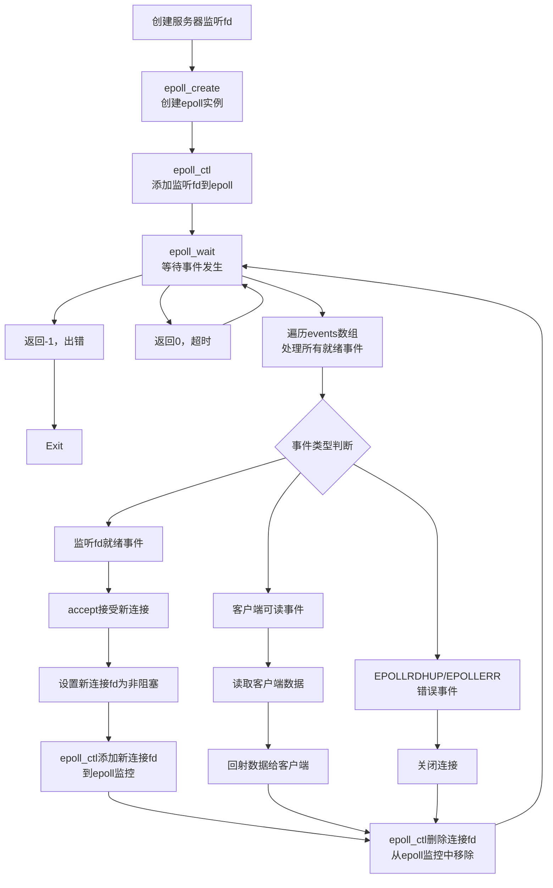

```mermaid
flowchart TD
    A[创建服务器监听fd] --> B[epoll_create<br>创建epoll实例]
    B --> C[epoll_ctl<br>添加监听fd到epoll]
    C --> D[epoll_wait<br>等待事件发生]
    D --> E[遍历events数组<br>处理所有就绪事件]
    D --> Q[返回0，超时]
    D --> R[返回-1，出错]
    R --> S[Exit]
    
    E --> F{事件类型判断}
    F --> G[监听fd就绪事件]
    F --> H[客户端可读事件]
    F --> I[EPOLLRDHUP/EPOLLERR<br>错误事件]
    
    G --> J[accept接受新连接]
    J --> K[设置新连接fd为非阻塞]
    K --> L[epoll_ctl添加新连接fd<br>到epoll监控]
    
    H --> M[读取客户端数据]
    M --> N[回射数据给客户端]
    
    I --> O[关闭连接]
    
    L --> P[epoll_ctl删除连接fd<br>从epoll监控中移除]
    N --> P
    O --> P
    
    P --> D
    Q --> D
```